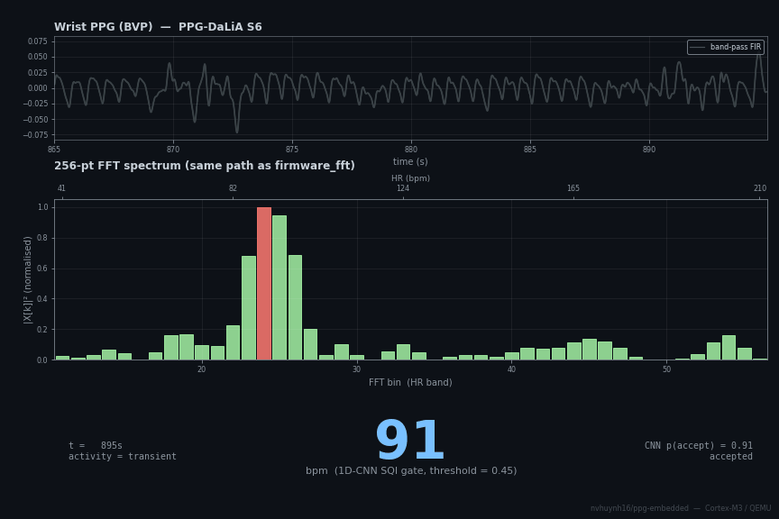
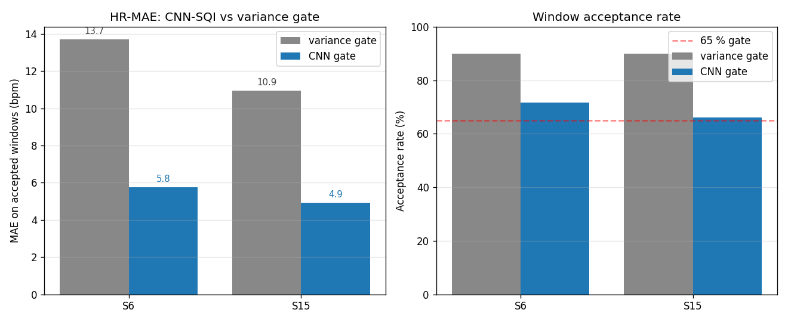

# Embedded PPG Heart-Rate + Respiration-Rate Estimator — ARM Cortex-M3 (QEMU)

<p align="center">
  
  <br>
  <em>
  <b>What you're seeing:</b> wrist PPG from PPG-DaLiA subject S6 around the sit→stairs transition at t ≈ 920 s.
  <br>
  <b>Top panel</b> — raw band-pass-filtered BVP, with each 2-second segment recoloured by the CNN-SQI decision on the 8-second window ending at that point.
  <b>Mint = CNN accepts</b> (reliable), <b>gray = CNN rejects</b> (motion-corrupted, unreliable).
  <br>
  <b>Middle panel</b> — 256-pt FFT magnitude² spectrum over the HR band. The <b>red bar</b> is the current peak bin; the top x-axis maps bins to bpm so you can read HR directly off the plot. During motion the spectrum becomes broad/multimodal and the peak bin jumps around frame-to-frame.
  <br>
  <b>Bottom panel</b> — the live HR readout the firmware would publish. When the CNN accepts, you see the FFT-path bpm; <b>when it rejects, you see "--"</b> — the smart-watch convention for "signal quality insufficient, don't act on this." That's the actual product the gate delivers: a system that says "I don't know" instead of confidently reporting a wrong number during arm motion.
  </em>
</p>

[](.github/workflows/ci.yml)
[](results/coverage.md)
[](LICENSE)

Fixed-point (Q15) photoplethysmography (PPG) → band-pass FIR → **three alternative
estimators plus a learned signal-quality gate**, all on a single Cortex-M3:

- **Peak detector** (time-domain, median-inter-peak-interval HR)
- **256-pt FFT spectral path** with sub-harmonic check
- **BW-path respiration rate** — lowpass FIR + decimate + 24-bin Goertzel scan
- **1D-CNN SQI gate** (~1k parameters, trained on PPG-DaLiA, float-32 inference) — decides per-window whether the FFT/peak HR estimate is trustworthy; cuts held-out HR-MAE on motion-corrupted wrist PPG from 12.0 → 5.3 bpm (−6.8 bpm).

The three classical estimators are in Q15 fixed-point; the CNN inference is in float (libgcc soft-float on the M3) and bit-exact between Python and C. **Validated in emulation (QEMU `lm3s6965evb`)** against the **PhysioNet BIDMC dataset (53 records)** for HR/RR and **PPG-DaLiA** (15 subjects) for the SQI gate, with patient-cluster bootstrap CIs and per-subject train/val/test splits respectively. **No hardware required.**

> **Honesty note:** results are produced **in emulation**, not on a physical board.
> Footprint numbers (text/data/bss bytes from `arm-none-eabi-size`) are exact; cycle-count
> and timing claims are deliberately omitted because QEMU `lm3s6965evb` is not cycle-accurate.

## Results (BIDMC, 53 records, 30 s non-overlapping windows)

Headlines with patient-cluster bootstrap **95 % CIs** (10k iterations, seeded — see
[`src/bootstrap.py`](src/bootstrap.py) for why cluster, not window, resampling).

### Heart rate

| Metric                | Peak detector              | **FFT + sub-harmonic**     |
|---                    |                       ---: |                       ---: |
| n (estimable)         | 772                        | **794**                    |
| MAE                   | 2.33 [1.32, 3.61] bpm      | **1.72 [1.03, 2.67] bpm**  |
| RMSE                  | 6.81 bpm                   | **5.96 bpm**               |
| % within ±5 bpm       | 89.8 [82.6, 95.5] %        | **93.8 [89.2, 97.5] %**    |
| % within ±3 bpm       | 85.4 [77.3, 92.3] %        | **91.6 [86.1, 96.1] %**    |
| Pearson r             | 0.884 [0.73, 0.97]         | **0.906 [0.79, 0.98]**     |
| Algorithm-failure %   | 2.8                        | **0.0**                    |

The FFT path with the sub-harmonic check strictly dominates the peak detector on
every metric. The sub-harmonic check (`firmware/main_fft.c`) catches PPG morphologies
where the 2nd harmonic carries more spectral energy than the fundamental — without it,
the in-band peak-bin search locks onto 2× HR. The threshold (α = 1/3) is emitted as
`FFT_SUBHARMONIC_DIVISOR` from `firmware/generated/fft_data.h` by `src/reference.py`,
so it's tunable without editing C.

### Respiration rate (BW path)

| Metric (estimable, n=786)  | Point [95 % CI]           |
|---                         |                       ---: |
| MAE                        | **3.02 BrPM**              |
| % within ±2 BrPM           | 66.3 %                     |
| % within ±4 BrPM           | 75.2 %                     |
| Pearson r                  | 0.317 [0.151, 0.465]       |

On the bidmc01-03 smoke subset (n=45): MAE 1.21 BrPM, 88.9 % within ±2.
The full-corpus number is dragged down by mechanically-ventilated patients whose
fixed-paced RR produces less baseline modulation, and whose impedance-pneumography
reference is itself noisy. Methodology, three-way decomposition, and the
no-leakage statement are in [`results/README.md`](results/README.md).

## 1D-CNN signal-quality gate (PPG-DaLiA, motion-corrupted)

BIDMC is clinical-grade ICU data — the classical DSP variance gate is fine
there because the signal is clean. **PPG-DaLiA** (Reiss 2019, wrist-worn
during daily activity — sit, stairs, soccer, cycling, walking, …) is the
opposite regime: motion artefacts shred the signal often enough that the
variance gate accepts > 90 % of windows but the FFT-path HR estimate on
those windows is 10–15 bpm off.

A tiny **1D-CNN** (~1k parameters) replaces the variance gate. Architecture
in [`src/sqi_cnn.py`](src/sqi_cnn.py); trained on 11 PPG-DaLiA subjects,
validated on 2, held-out test on the remaining 2:

| Held-out subject | windows | variance MAE  | variance accept | CNN MAE | CNN accept | Δ-MAE |
|---               |    ---: |          ---: |            ---: |    ---: |       ---: |  ---: |
| S6               |    2622 | 13.70 bpm     | 90.0 %          | **5.76**  | 71.7 %  | **−7.94** |
| S15              |    3966 | 10.94 bpm     | 90.0 %          | **4.91**  | 66.0 %  | **−6.03** |
| **POOLED**       |  **6588** | **12.04 bpm** | **90.0 %**  | **5.27**  | **68.3 %** | **−6.77** |

<p align="center">
  
</p>

The CNN is **ported to Cortex-M3** (float kernel, [`firmware/dsp_cnn.c`](firmware/dsp_cnn.c) +
[`firmware/main_sqi.c`](firmware/main_sqi.c) + Makefile target `firmware_sqi.elf`).
Footprint: **8.5 KB text + 24 KB BSS** (within the lm3s6965's 64 KB SRAM).
A bit-exact contract is enforced by [`src/verify_cnn.py`](src/verify_cnn.py):
on a deterministic synthetic input, the numpy reference and the C kernel
agree to the LSB (×1e6 fixed-point encoding, |Δ| = 0).

The training pipeline (PyTorch) and the trained weights are intentionally **not**
in the public repo — the inference code is, and the firmware's
[`firmware/generated/cnn_data.h`](firmware/generated/cnn_data.h) ships with
**placeholder weights** so the build/CI works without leaking the trained model.
Real predictions require regenerating the header against a locally-trained `.npz`.

## Code-reading guide (for reviewers)

The repo spans Python golden model + Cortex-M3 firmware + validators + animations.
If you're skimming, follow the depth you have:

- **Short read** — The four files that contain the actual algorithms:
  [`firmware/main_fft.c`](firmware/main_fft.c) (100 lines — the FFT pipeline with
  the sub-harmonic check), [`firmware/dsp_fft.c`](firmware/dsp_fft.c)
  (the Q15 radix-2 FFT with per-stage `>>1` scaling),
  [`firmware/main_rr.c`](firmware/main_rr.c) (60 lines — BW-path respiration), and
  [`docs/qformat_proof.md`](docs/qformat_proof.md) (closed-form overflow proof for
  every Q15 variable). Then [`results/README.md`](results/README.md) for the
  method-comparison + the disjoint-failure analysis that motivated the
  sub-harmonic check.

- **Deep read** — [`src/reference.py`](src/reference.py) (the Python golden model
  that emits every header the C side reads), [`firmware/dsp_fixed.{c,h}`](firmware/dsp_fixed.c)
  + [`firmware/dsp_resp.{c,h}`](firmware/dsp_resp.c) (the Q15 primitives), and the
  three sweep validators (`src/batch_validate.py`, `src/compare_methods.py`,
  `src/validate_rr.py`) sharing [`src/_firmware_io.py`](src/_firmware_io.py).

## Why these choices

- **Q15 not Q31** — Cortex-M3 has no SIMD; Q15 hits the int16 register width
  directly. The +6 dB headroom Q31 buys is rarely needed when inputs are
  already in Q15 (PPG normalised to `[−0.9, +0.9]`). The Q-format proof
  confirms no overflow at the current hyperparameters.

- **FFT path AND peak detector** — the peak detector misses real beats under
  strong dicrotic notches (2.8 % algorithm-failure on BIDMC). Spectral methods
  integrate energy across the cardiac cycle, so they're robust to a few missed
  peaks. Shipping both lets the head-to-head comparison be defensible rather
  than rhetorical.

- **Goertzel not FFT for RR** — only 24 candidate frequencies are interesting
  (6–30 BrPM at 1-BrPM resolution). A second 256-pt FFT would compute 128 bins
  we don't need. Goertzel is a single-frequency IIR resonator; 24 of them is
  cheaper in flash, RAM, and cycles than one FFT.

- **BIDMC for validation, not synthetic only** — synthetic PPG shows the
  algorithm works in the best case. BIDMC stresses it with real motion
  artifacts, dicrotic notches, atrial fibrillation episodes, and varying
  signal-to-noise. The cross-modality reference (ECG-derived HR) catches
  PPG-specific failure modes a within-modality reference would mask.

- **No cycle counts** — QEMU `lm3s6965evb` is a *functional* emulator, not
  cycle-accurate. Flash/SRAM bytes from `arm-none-eabi-size` are exact;
  timing claims would be fiction. Renode on a Cortex-M4F target is the path
  to honest µs-per-window numbers.

## Firmware footprint (`arm-none-eabi-size`)

| Build                       | .text   | .bss   | Flash use         | SRAM use         |
|---                          |    ---: |   ---: | ---:              | ---:             |
| `firmware.elf`     (peak)   | 4.5 KB  | 7.0 KB | 1.7 % of 256 KB | 10.8 % of 64 KB |
| `firmware_fft.elf` (FFT)    | 6.6 KB  | 6.0 KB | 2.5 % of 256 KB |  9.2 % of 64 KB |
| `firmware_rr.elf`  (RR)     | 5.5 KB  | 7.5 KB | 2.1 % of 256 KB | 11.4 % of 64 KB |

FFT path costs +2 KB flash (FFT code + Q15 twiddle + Hamming) but uses 1 KB *less* SRAM
than the peak detector (it doesn't need the `peak_idx[]` and `intervals[]` working
buffers). RR path adds the lowpass FIR coefficients + Goertzel tables.

## Layout

```
ppg-embedded/
├── src/
│   ├── reference.py            # golden model: emits ppg/fft/resp_data.h + golden.json (stdlib OK)
│   ├── validate.py             # synthetic-input QEMU sanity check (PASS/FAIL)
│   ├── batch_validate.py       # BIDMC sweep: per-window QEMU → metrics.json + plots
│   ├── compare_methods.py      # head-to-head peak vs FFT on BIDMC
│   ├── validate_rr.py          # BIDMC sweep for the RR path
│   ├── respiration.py          # Python reference for the BW-path RR estimator
│   ├── bootstrap.py            # patient-cluster bootstrap CIs
│   ├── window_sweep.py         # MAE / accuracy / failure-rate vs window length
│   ├── qformat_proof.py        # Monte-Carlo Q15 dynamic-range validator
│   ├── verify_fft.py           # bit-exactness vs numpy.fft (host gcc, no QEMU)
│   ├── sqi.py                  # signal-quality gate
│   ├── footprint.py            # arm-none-eabi-size → results/footprint.md
│   ├── _firmware_io.py         # shared firmware build + QEMU helpers
│   ├── _anim_helpers.py        # shared palette + BIDMC loader + ffmpeg save
│   ├── make_peak_anim.py       # peak-pipeline anim → results/web/pipeline.{gif,mp4}
│   ├── make_fft_anim.py        # FFT spectrum + sub-harmonic swap anim
│   └── make_rr_anim.py         # 24-bin Goertzel scan + RR readout anim
├── firmware/
│   ├── main.c                  # peak-detector entry point + semihosting output
│   ├── main_fft.c              # FFT-path entry point
│   ├── main_rr.c               # BW-path RR entry point
│   ├── dsp_fixed.[ch]          # Q15 FIR + peak detection + median-interval HR
│   ├── dsp_fft.[ch]            # Q15 radix-2 DIT FFT (in-place, per-stage scaling)
│   ├── dsp_resp.[ch]           # Q15 Goertzel + saturating decimation
│   ├── host_test.c             # host-side peak-detector canary (no QEMU)
│   ├── host_fft_test.c         # host-side FFT canary (prints CSV spectrum)
│   ├── test_dsp_fixed.c        # Unity unit tests for dsp_fixed
│   ├── test_dsp_fft.c          # Unity unit tests for dsp_fft
│   ├── unity.{c,h}             # vendored Unity test framework (MIT)
│   ├── semihost.h              # semihosting print/exit/print-uint
│   ├── startup.c               # vector table + reset handler
│   ├── lm3s6965.ld             # Cortex-M3 / LM3S6965 memory map
│   ├── Makefile                # `make test`, `make coverage`, three ELF targets
│   ├── run_qemu.sh             # qemu-system-arm -M lm3s6965evb -kernel <elf>
│   └── generated/
│       ├── ppg_data.h          # AUTO-GENERATED test vector + FIR coeffs
│       ├── fft_data.h          # AUTO-GENERATED Q15 twiddle + Hamming + α threshold
│       └── resp_data.h         # AUTO-GENERATED lowpass coeffs + Goertzel tables
├── data/bidmc_cache/           # 3 BIDMC records cached for CI (full sweep fetches locally)
├── results/                    # bidmc.csv, metrics.json, plots, coverage, footprint, …
│   └── web/                    # pipeline animations (untracked except pipeline_fft.gif)
├── docs/                       # Q-format dynamic-range proof
├── ci/                         # baseline metrics for the perf-regression gate
├── scripts/check_regression.py # CI gate: current sweep vs baseline metrics
├── .github/workflows/          # ci.yml (build + test + static analysis + coverage + sweep smoke)
└── pyproject.toml              # uv project
```

## Prerequisites

```bash
# Embedded toolchain + emulator (Debian/Ubuntu/Pop!_OS):
sudo apt install build-essential gcc-arm-none-eabi qemu-system-arm

# Python reference runs on bare stdlib (python3). For BIDMC / numpy.fft / plots / animations:
uv sync          # installs numpy, scipy, matplotlib, wfdb, imageio-ffmpeg
                 # (imageio-ffmpeg bundles a portable ffmpeg, no system install needed)
```

## Run

Default pipeline (peak detector, synthetic input):

```bash
./run_all.sh
```

Or step by step:

```bash
python3 src/reference.py            # emit firmware/generated/*.h + golden.json
make -C firmware                    # build firmware.elf
python3 src/validate.py             # QEMU run + compare → PASS/FAIL
```

**FFT path:**

```bash
make -C firmware firmware_fft.elf
bash firmware/run_qemu.sh firmware_fft.elf
```

**RR path:**

```bash
make -C firmware firmware_rr.elf
bash firmware/run_qemu.sh firmware_rr.elf
```

**Unit tests + coverage** (sub-second; host-compile, no QEMU):

```bash
make -C firmware test
make -C firmware coverage           # → results/coverage.md
```

**Full BIDMC sweep (peak detector):**

```bash
uv run python src/batch_validate.py \
  --records $(seq -f 'bidmc%02g' 1 53 | paste -sd,) --window 30
# → results/{bidmc.csv, metrics.json, bland_altman.png, hr_scatter.png}
```

**Head-to-head FFT vs peak:**

```bash
uv run python src/compare_methods.py --records bidmc01,...,bidmc10 --window 30
# → results/method_comparison.{csv,json,md,png}
```

**RR validation:**

```bash
uv run python src/validate_rr.py --records bidmc01,bidmc02,bidmc03 --window 30
# → results/respiration.{csv,json,png}
```

**FFT bit-exactness vs numpy.fft + Q15 dynamic-range proof:**

```bash
uv run python src/verify_fft.py
uv run python src/qformat_proof.py
```

**Regenerate the demo animations:**

```bash
uv run python src/make_peak_anim.py    # also: make_fft_anim.py, make_rr_anim.py
```

